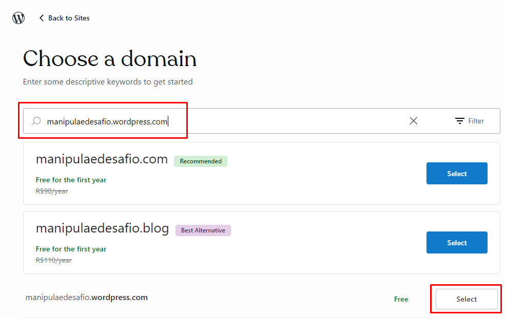
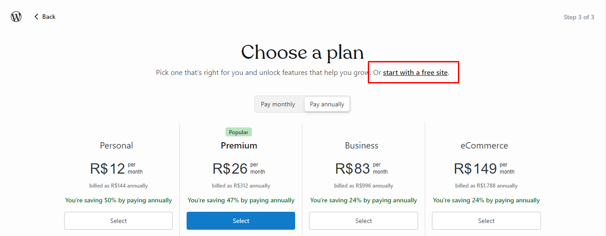
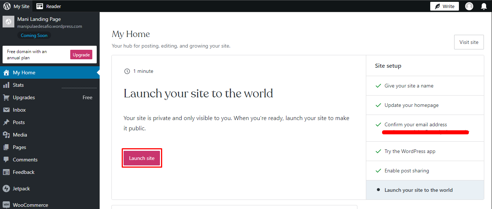
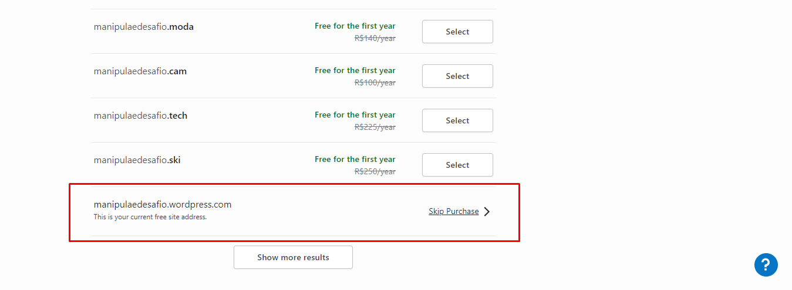
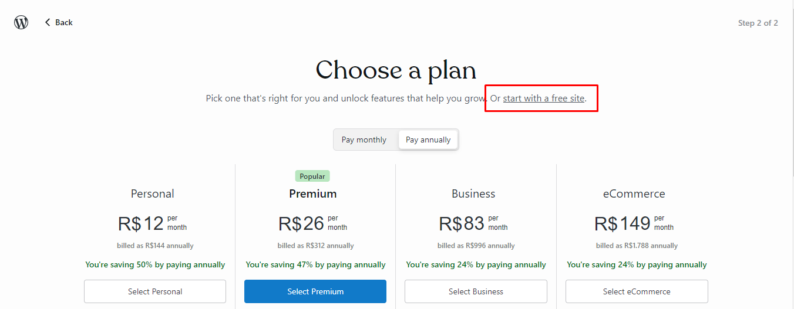

<h1 align="left">
   ❤️‍🩹 Manipulaê
</h1>

Parabéns por ser selecionado!

Esperamos que tenha um ótimo desempenho no teste e venha junto com o time mudar o mercado farmacêutico!

## O que esperamos? 🤨

O objetivo principal deste desafio é avaliar sua capacidade de entender necessidades e desenvolver soluções. Capriche!

 

## Sobre o desafio 🤯

Situação problema:
Imagine que o time de marketing da Manipulaê pretende realizar o lançamento de um novo produto para melhorar a qualidade do sono e disposição de quem consumir. Sendo que parte deste lançamento contará com uma landing page que será inserida em um servidor web com wordpress. 

Você ficou responsável por planejar, criar estilo e desenvolver esta página wordpress. E está livre para voar, definir cores, sessões imagens, animações textos. Também está livre para usar as melhores tecnologias web que atendam o problema, desde que os arquivos entregáveis sejam compatíveis com a versão mais moderna do wordpress.

## Direcionamento 😇

Você pode disponibilizar a solução da maneira que achar mais sensato para avaliarmos seu trabalho.

 

<b>A seguir algumas orientações oque você pode está seguindo para disponibilizar sua entrega.</b>
 
  
  - <b>Na Plataforma do Wordpress</b> 
  - <b>1º Escolha domínio com terminação "wordpress.com"</b> 
   

  

  - <b>2º Escolha seguir plano gratuíto</b> 
   

  

  - <b>3º Publique sua Landing Page</b> 
   

  

  - <b>4º Ao final da página siga com domínio gratuíto</b> 
   

  

  - <b>5º Escolha seguir plano gratuíto</b> 
   
  
  

  - <b>Pronto! ✅ nos envie o link do seu domínio para avaliarmos seu trabalho.</b> 

## Prazo de entrega 🤓

O desafio deve ser realizado em 6 dias a partir da data de envio do desafio, o gerenciamento do tempo e também será um fator de análise.
<b>IMPORTANTE, CASO NÃO CONCLUA A TEMPO, NÃO DEIXE DE ENVIAR O QUE FOI FEITO DURANTE OS 6 DIAS!</b>

## Boa sorte!